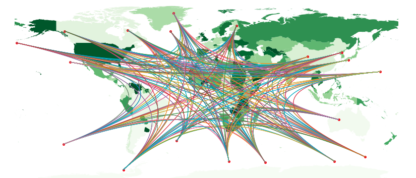

# World Map Population Visualization 

Using matplotlib to plot coordinate points and visualize relationship between population labels/classifications from different datasets

This notebook requires geopandas, using conda is advisable. Conda env can be activated and used in jupyter-notebook kernel by running following command from the activated env:

> python -m ipykernel install --user --name myenv --display-name "Python (myenv)"

Then, jupyter-notebook can be called.

Data (.shp) can be obtained from site: https://thematicmapping.org/downloads/world_borders.php and unzipped content is assumed to be in ./data directory. 
